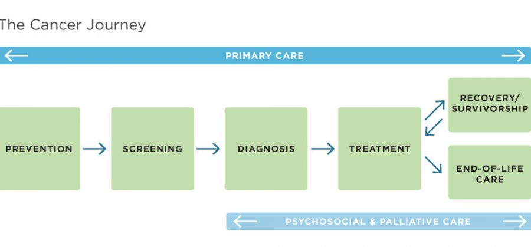

# List of required modules
Please use the requirements.txt file to reproduce the environement


# Carepath Prediction using NLP technics
 <!-- You can replace this with a banner/image relevant to your project -->

## Carepath Prediction

Welcome to the analysis of some carepathes dataset. 
In this project, we want to try a DeepLearning Approach in order to predict the next activity of a patient.

## Table of Contents

- [Installation](#installation)
- [Motivation](#motivation)
- [Questions](#questions)
- [Data Exploration](#data-exploration)
- [Training Models](#training-models)
- [Models Analysis](#models-analysis)
- [Results](#results)
- [Licensing and Authors](#licensing-and-authors)

## [Installation](#installation)

1. Clone this repository to your local machine using:
   ```bash
    git clone https://github.com/VinceWeber/Carepath_Prediction_NLP/

2. Navigate to the project directory:
   ```bash
    cd Carepath_Prediction_NLP
3. Create the anaconda environment using:
    ```bash
    conda create -n name_env_project --requirements.txt
    ```
4. Activate the environment:
   ```bash
   conda activate name_env_project
   ```
    Replace 'name_env_project' by a custom environnement name.

## [Motivation](#motivation)


## [Questions](#questions)


## [Data Exploration](#data-exploration)

- 

## [Training Models](#training-models)

- 

## [Models Analysis](#models-analysis)

A thorough analysis of the trained models, their performance metrics, and conclusions drawn from the analysis. [insights and results from the Models section]

## [Results](#results)

- The Linear approach, regarding to the embedings vectors seems to predict accuratly some activities, but with a high variance. 
- The DeepLearning approach looks like to learn some patterns,but is 

## [Licensing and Authors](#licensing-and-authors)

This project is licensed under the MIT License.

_Authors:_
- Weber Vincent (vincent.weber@edu.dsti.institute)
- Alex Stephane Yeinko Tago (alex-stephane.yeinko-tago@edu.dsti.institute)
- Hassane Kadri Dodo (hassane.kadri-dodo@edu.dsti.institute)