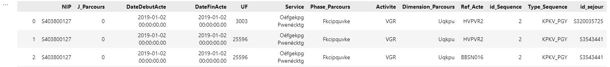

# List of required modules
Please use the requirements.txt file to reproduce the environement

# Carepath Prediction using NLP technics
 <!-- You can replace this with a banner/image relevant to your project -->

## Carepath Prediction

Welcome to the analysis of some carepathes dataset. 
In this project, we want to try a DeepLearning Approach in order to predict the next activity of a patient, from a fictive log of patient activity covering the Diagnosis, Treatment, Recovery and End_of_life Care.

## Table of Contents

- [Installation](#installation)
- [Data Exploration](#data-exploration)
- [Models Analysis](#models-analysis)
- [Results](#results)
- [Conclusion](#results)
- [Licensing and Authors](#licensing-and-authors)

## [Installation](#installation)

1. Clone this repository to your local machine using:
   ```bash
    git clone https://github.com/VinceWeber/Carepath_Prediction_NLP/

2. Navigate to the project directory:
   ```bash
    cd Carepath_Prediction_NLP
3. Create the anaconda environment using:
    ```bash
    conda create -n name_env_project --requirements.txt
    ```
4. Activate the environment:
   ```bash
   conda activate name_env_project
   ```
    Replace 'name_env_project' by a custom environnement name.
	
5. Install a Neo4j desktop : https://neo4j.com/download/?ref=desktop

6. In the second cell of the notebook, configure your connection to Neo4j server

## [Data Exploration](#data-exploration)

- Source : Anonymized activity of patients 
2 kinds of datasets availables :
	- Dataset_Simple_V0.csv : to check the correctness of the algorithm.
	- DL_Project_DAtaset_Cluster... : Bigger datasets to be tested.

- Structure of the data: 
 
it's a log file of activity, giving an Id of the patient, a datetime of the activity (Datedebut, Date_fin, and J_Parcours which define the starting date of the carepath),
 Where it has been relealizes (UF) plus some details of the activity.
 Which kind of Care has been given, according to a code of activity.
 Id of a "sejour', which represent a group of care activity given in a same visit at the hospital.
 Id and type of Sequence, which is a group of 'sejour' which took place in a close range of time (less than 3 monthes).

## [Models Analysis](#models-analysis)

- First of all we implement a modelization of the carepath in the Neo4j database and get back node Embeddings in order to create some "sentence of activity" for each patient.
- From this package of "sentences" we create randomly a train and test dataset to be applied on different models.
- Then we make a first approach with a linear model to check if we can predict some behaviour of this log activity.
- Then we apply a logic of text generation on a RNN neural network and try to predict the next activity of a patient.


## [Results](#results)

- The Linear approach, regarding to the embedings vectors seems to predict accuratly some activities, but with a high variance. 
- The DeepLearning approach looks like to learn some patterns, but is very sensitive to the data.
	- By using the Dataset_Simple_V0.csv, we can see that the loss converge rapidly to zero, meaning that the network is learning.
	- But by using the bigger Dataset, we can see that the loss oscilate around a mean value, and get sometimes a huge high "peak", meaning that 
	  something is changing in the input data, that can be a problem of inconsistency in the data.

## [Conclusion](#Conclusion)

- We need to go more in detail in some aspect :
	- Filtering, and cleaning the input Data.
	- Improve the neural network.
	- Test an LSTM network which is less sensitive than RNN on long sentences.


## [Licensing and Authors](#licensing-and-authors)

This project is licensed under the MIT License.

_Authors:_
- Weber Vincent (vincent.weber@edu.dsti.institute)
- Alex Stephane Yeinko Tago (alex-stephane.yeinko-tago@edu.dsti.institute)
- Hassane Kadri Dodo (hassane.kadri-dodo@edu.dsti.institute)